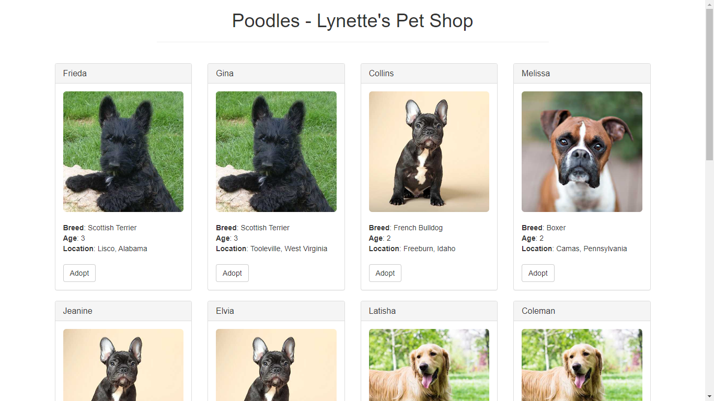
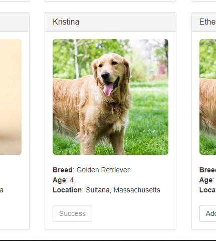
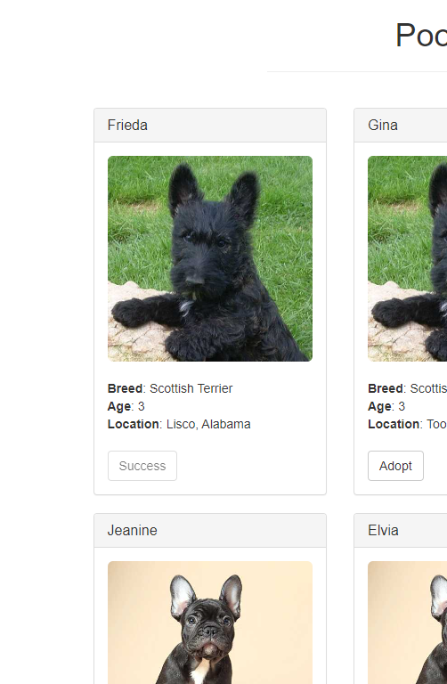

# Poodles - Lynette's pet shop decentralized application

- Start the local web server:

`npm run dev`

- The dev server launches and automatically opens a new browser tab containing the dapp.

- After a successful adoption, the button next to the adopted pet changes to say "Success" and becomes disabled

Link to the tutorial: <https://trufflesuite.com/guides/pet-shop/>
